# Project-18 - Rode.Com's-Landing-Page

## Description:

> *A humble attempt to replicate and develop a fully-responsive Landing Page of Rode.com using Tailwind CSS and its few Component Libraries like TailBlocks, Mamba UI and Flowbite Blocks.*

# 

**Landing-Page-Images:**

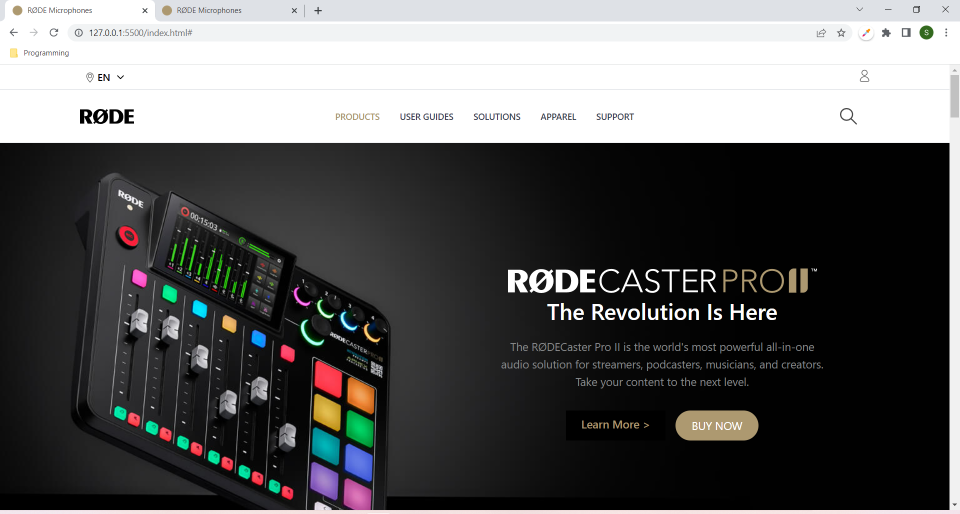

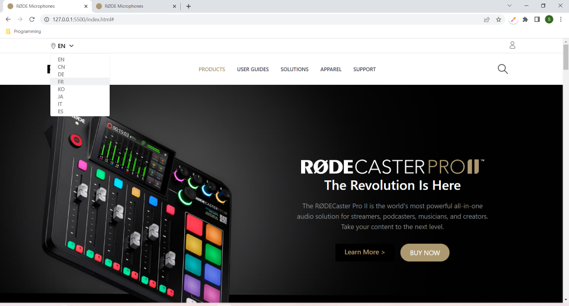

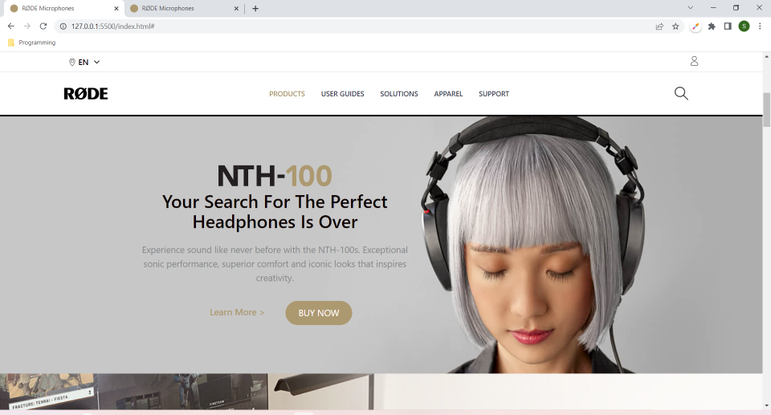

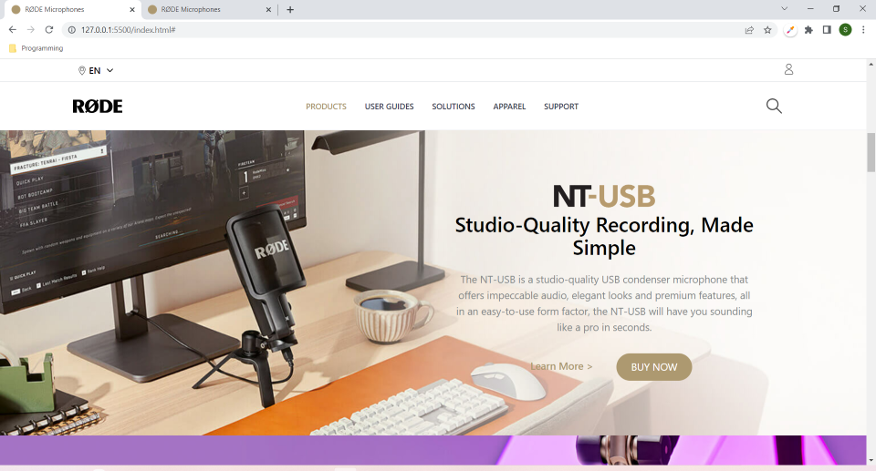

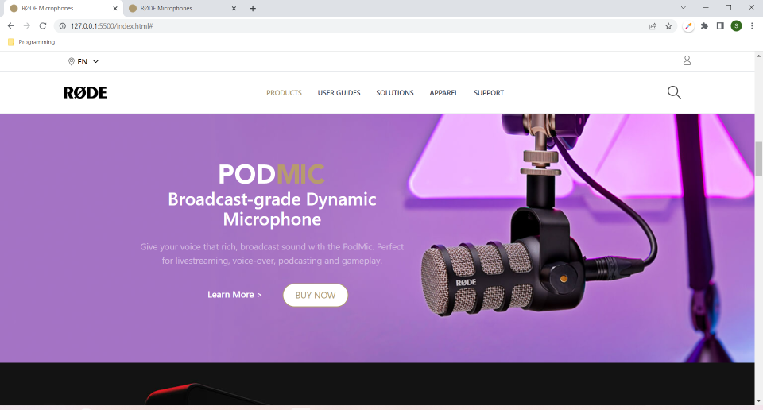

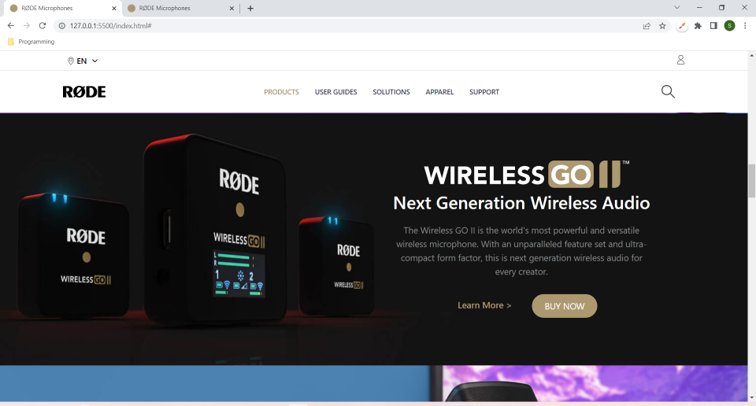

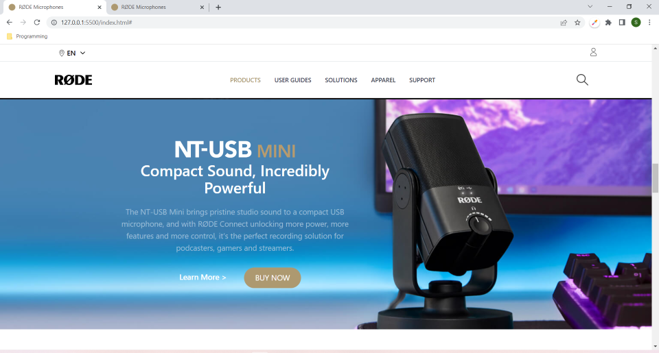

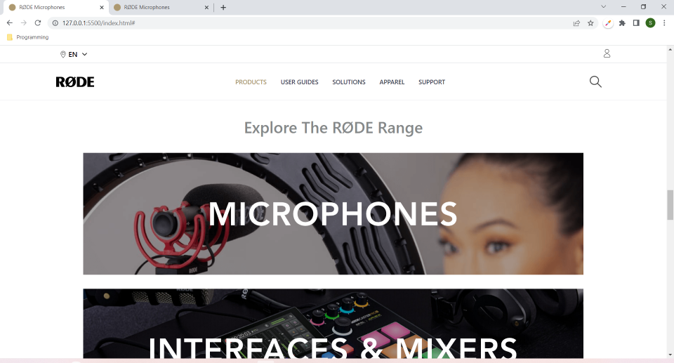

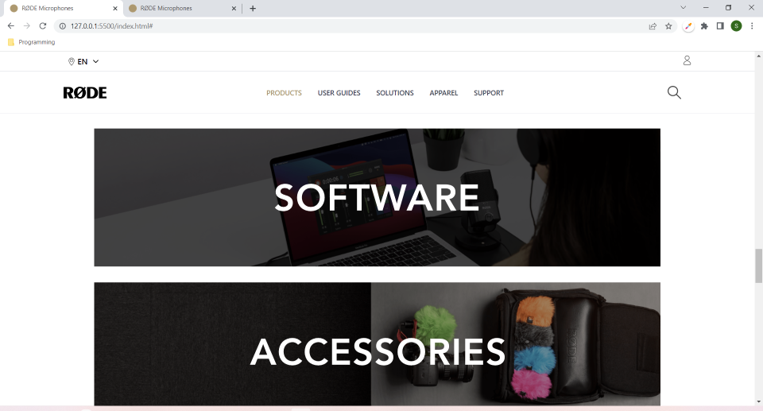

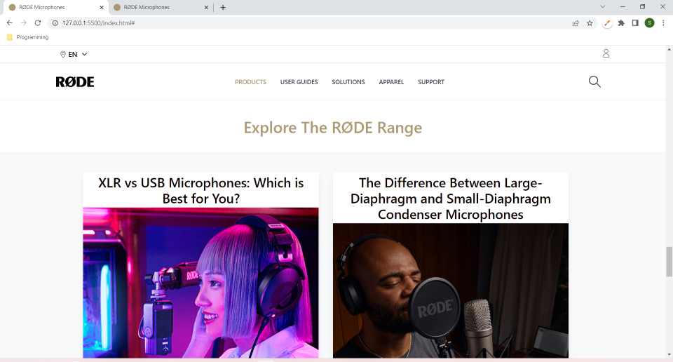

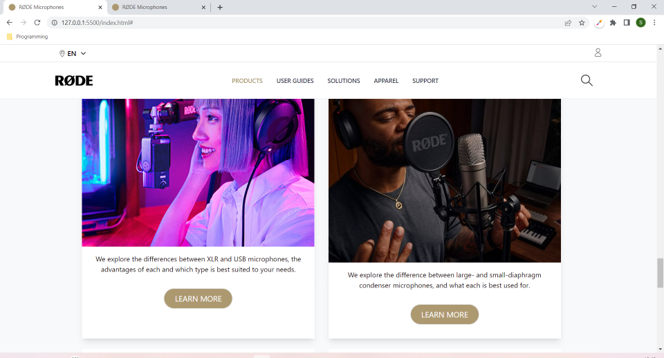

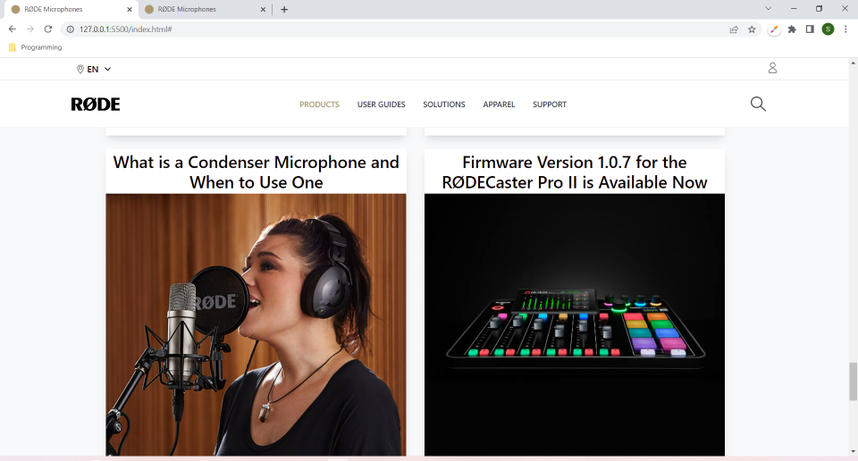

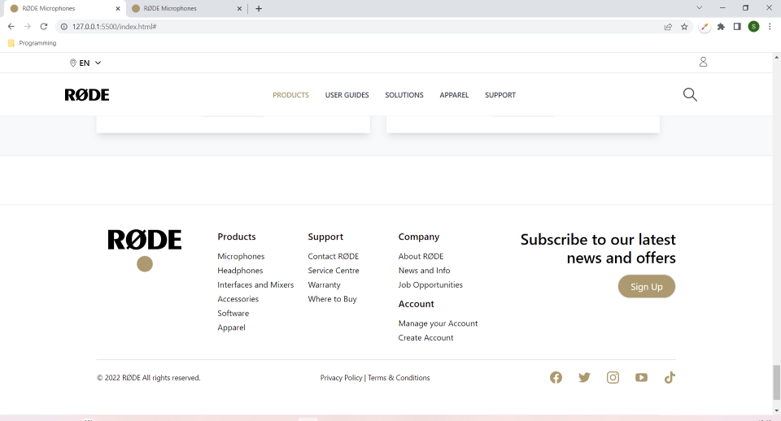

#

## What I have learnt while making this project?

> *Not only I have gotten more comfortable using Tailwind CSS classes and referring to its documentation, but with this project, I have also gotten more familiar and comfortable with using Tailwind component libraries' code and components. I also got to learn a bit about customization with Tailwind CSS, like making changes in tailwind.config to increase the priority of Tailwind CSS properties over inline styles by making **important** as **true**. I used this to change the placement of the Language drop-down menu in the Header. Hence, I can say that it was quite fruitful to work on this project.*

#

## Time taken to complete this project:
> *Around 7 hrs were spent in developing this fully-reponsive Landing Page of Rode.com*

#

## Please see this project in action at below link:

**[Click to redirect to Project-18-Rode.com](https://p18-rode.netlify.app/)**

#

## Developed by:

**Sidharth Pandey**

**[Contact Me](mailto:sidp0008@gmail.com)**

#